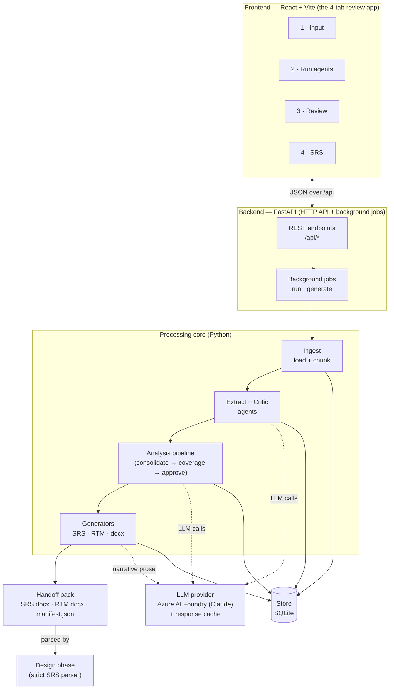
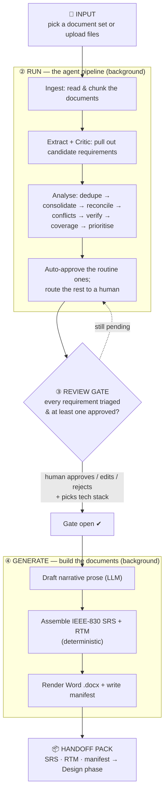
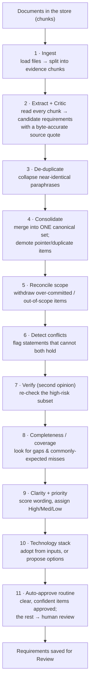
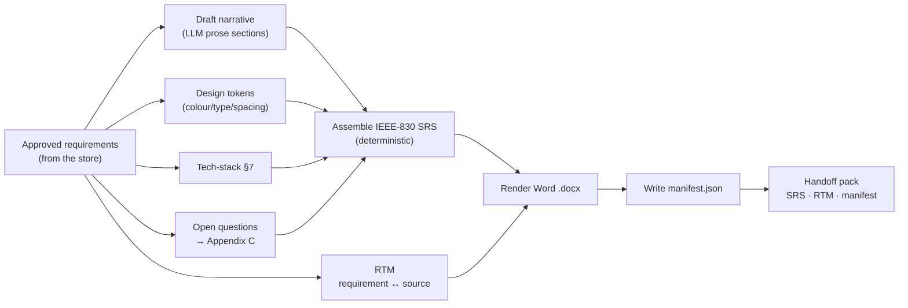

# RGA — System Architecture

This document explains how **RGA (Agentic Requirement Gathering & Analysis)** is built and how data
flows through it, from raw documents to the final SRS + RTM handoff pack. The diagrams are written
in [Mermaid](https://mermaid.js.org/) and render automatically on GitHub and in most Markdown viewers.

**Reading order:** §1 the big picture → §2 the end‑to‑end flow → §3 the agent pipeline in detail →
§4 document generation → §5 the moving parts (components).

---

## 1. High‑level architecture

**What each layer does**

1. **Frontend (React + Vite).** The review app the user actually sees — four tabs: *Input*,
   *Run agents*, *Review*, *SRS*. It talks to the backend purely over JSON at `/api/*` and never
   contains business logic; it renders state and sends the user's decisions back.
2. **Backend API (FastAPI).** Exposes the REST endpoints and runs the two long operations —
   *run* (the agent pipeline) and *generate* (document creation) — as **background jobs**, so the UI
   stays responsive and simply polls for progress.
3. **Processing core.** The Python that does the work: **Ingest** → **Extract** → **Analysis** →
   **Generate**. This same core is shared by the API and the command‑line tool, so there is one
   source of truth for behaviour.
4. **LLM provider.** All AI calls go through one abstraction. In production it's **Claude on Azure
   AI Foundry**; a **cache** stores every response so re‑runs are fast and cheap, and a **mock**
   provider lets tests run with no network.
5. **Store (SQLite).** Requirements, source chunks, and review decisions are persisted, so a run
   survives a page reload and the review is durable.
6. **Handoff pack.** The final deliverables, consumed by the next phase (Design) via a strict parser.

---

## 2. End‑to‑end flow (the four phases)

**Step‑by‑step**

1. **Input.** The user selects a prepared document set (or uploads their own). The app shows the
   metadata of every file first, so it's clear exactly what's being fed in.
2. **Run (background).** Clicking *Run* starts the agent pipeline. The UI polls for progress and
   shows each stage completing with a green tick. (The pipeline is detailed in §3.)
3. **Review gate.** This is the human control point. RGA groups its findings into a short list of
   **decisions**, each with a recommendation. Nothing proceeds to document generation until *every*
   requirement has been triaged **and** at least one is approved — a hard gate that guarantees no
   un‑reviewed content ever reaches the output.
4. **Generate (background).** Once the gate is open, RGA drafts the descriptive prose with the LLM,
   then **deterministically** assembles the IEEE‑830 SRS and the RTM, renders them to Word, and
   writes a manifest.
5. **Handoff.** The finished pack is ready for the Design phase.

---

## 3. The agent pipeline in detail (Phase ②)

This is what happens inside "Run agents". Each box is a stage the UI reports live.

**What each stage does**

1. **Ingest.** Loads each document (`.docx`, `.pdf`, `.txt`, `.md`, `.csv`, …) and splits it into
   small **chunks** — the pieces of evidence everything later traces back to.
2. **Extract + Critic.** An extraction agent reads each chunk and proposes candidate requirements;
   a critic agent checks that each one is genuinely a requirement and is **grounded** — backed by an
   exact quote from the source. This is what makes every requirement auditable.
3. **De‑duplicate.** The same requirement often appears in several documents in slightly different
   words; this stage collapses those near‑paraphrases so we don't count them twice.
4. **Consolidate.** Merges everything into a single **canonical set** — one clean statement per
   requirement — and demotes vague "pointer" items that just reference others.
5. **Reconcile scope.** Removes items the sources explicitly mark as out of scope or over‑committed,
   so the spec reflects what's actually in this release.
6. **Detect conflicts.** Finds requirements that contradict each other and flags them for a human to
   resolve (rather than silently picking one).
7. **Verify (second opinion).** Re‑examines the riskiest requirements with an independent check;
   anything that looks shaky is moved to the open‑items list instead of being trusted.
8. **Completeness / coverage.** Looks for gaps — requirements a product like this would normally
   need but the documents didn't mention — and surfaces them as suggestions.
9. **Clarity + priority.** Scores each requirement's wording for ambiguity and assigns a priority
   (High / Medium / Low) based on the source signals.
10. **Technology stack.** If the inputs state a stack, it's adopted; otherwise RGA proposes a few
    simple, popular options per area (frontend, backend, database, …) with a recommended default.
11. **Auto‑approve routine.** The clean, high‑confidence, low‑risk requirements are auto‑approved
    (each logged); everything that genuinely needs a human is routed to the Review screen.

> **Human review (Phase ③)** then runs on top of this: RGA clusters the remaining calls into
> **decisions** (conflicts, scope, gaps, …), each owner‑routed and with a recommended resolution.
> Resolving one decision applies to every requirement it affects. The reviewer also confirms the
> technology stack. When the gate opens, generation is unlocked.

---

## 4. Document generation (Phase ④)

**How the documents are built**

- **Narrative (LLM).** Only the *descriptive prose* sections (purpose, scope, overview, feature
  stimulus/response, etc.) are written by the LLM. If the LLM is unavailable, these degrade to a
  clearly‑marked placeholder — they never block generation.
- **Structured content (deterministic).** The requirements themselves, the User‑Classes and
  Software‑Interfaces tables, the design‑token tables, the glossary, the tech‑stack, and Appendix C
  are generated **from data, not from the LLM** — so the document's structure is identical and
  parser‑safe every single run.
- **RTM.** The Requirements Traceability Matrix links each requirement to the exact source line it
  came from, giving a full audit trail.
- **Word render + manifest.** Everything is rendered to `.docx` (with correct heading styles so the
  Design team's parser can read it), and a `manifest.json` records what was produced.

> The Design team consumes `SRS.docx` with a strict parser that depends on this exact structure —
> see [`INTEGRATION.md`](INTEGRATION.md) for that contract.

---

## 5. Components at a glance

| Component | Tech | Role |
|-----------|------|------|
| **Frontend** | React + Vite + TypeScript, TanStack Query | The 4‑tab review UI; talks to `/api` only |
| **Backend API** | FastAPI (Python) | REST endpoints + background jobs (run / generate) |
| **Ingest** | custom loaders + chunker | Turn documents into evidence chunks |
| **Agents** | LLM + deterministic rules | Extract, critique, consolidate, verify, prioritise, propose tech stack |
| **Orchestrator** | LangGraph `StateGraph` | Wires the pipeline stages together (shared by CLI + API) |
| **LLM provider** | Claude via Azure AI Foundry, + cache + mock | All AI calls, behind one interface |
| **Store** | SQLite (async) | Persists requirements, chunks, review decisions |
| **Generators** | python‑docx + templates | Build the IEEE‑830 SRS, RTM, and Word renders |
| **Handoff** | `SRS/RTM (.md + .docx)` + `manifest.json` | The deliverables for the Design phase |

**Two guarantees worth remembering:**
1. **Traceability** — every requirement carries a byte‑accurate quote from its source; the RTM makes
   the trail explicit.
2. **Human‑in‑the‑loop** — a hard review gate means nothing un‑approved ever reaches the documents.

---

*See also: [`README.md`](README.md) (setup + run), [`INTEGRATION.md`](INTEGRATION.md) (API & UI
contract for the combined SDLC frontend).*
