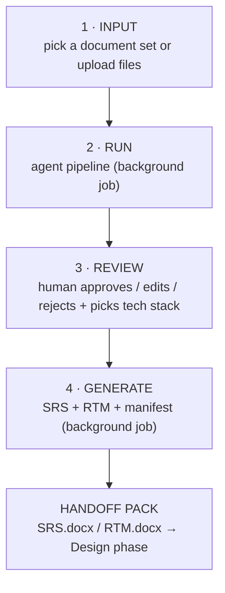

# RGA — Integration Guide for the Combined SDLC Frontend

**Audience:** the team building the unified SDLC frontend that stitches every phase together.
**This phase:** **RGA — Agentic Requirement Gathering & Analysis.** It turns raw project
documents into a human‑reviewed, IEEE‑830 **SRS + RTM handoff pack** that the next phase
(Design) consumes.

This document is the contract for wiring RGA into the combined UI: **what it takes in, what it
produces, every API endpoint you can call, and exactly which logs/progress signals you should
surface to the user.**

---

## 1. What RGA does (in one paragraph)

You give RGA a set of project documents (BRD, discovery‑call notes, emails, NFR notes, ops
intake form, product backlog, …). A pipeline of LLM + deterministic agents reads them, extracts
candidate requirements, de‑duplicates and consolidates them into a canonical set, reconciles
scope, detects conflicts, runs a second‑opinion verification, checks coverage, then assigns
clarity/priority and auto‑approves the routine ones. A human reviews what's left, then RGA
generates the SRS (IEEE‑830) + RTM and a manifest as the handoff pack.

---

## 2. End‑to‑end flow



**Four UI phases**, each backed by API calls:

1. **Input** — `GET /api/corpora` lists available document sets (with per‑file metadata); the user
   selects one or uploads their own via `POST …/upload`, then starts the run.
2. **Run** — `POST …/run` kicks off a **background** pipeline; the UI **polls** `GET …/status`
   and renders the live stage tracker (see §6).
3. **Review** — `GET …/requirements`, `GET …/decisions`, `GET …/gate`; the user acts via the
   review endpoints and selects the technology stack. The **gate** must be open (every
   requirement triaged, ≥1 approved) before generation.
4. **Generate** — `POST …/generate` starts a **background** generation; the UI polls
   `GET …/generate-status`, then fetches artifacts via `GET …/artifacts`.

---

## 3. Inputs

### 3.1 Document sets (corpora)
A **corpus** is a folder with a `manifest.json` and its documents. Two kinds:

| Kind | Location | How it appears |
|------|----------|----------------|
| `dataset` | `backend/datasets/<name>/` | prepared sample sets, ship with the repo |
| `upload`  | `backend/data/uploads/<project>/` | created by the user via the upload endpoint |

**Accepted file formats:** `.docx`, `.pdf`, `.txt`, `.md`, `.csv`, `.json`, `.eml`.
Each file is classified into a `source_type` the chunker understands (`brd`, `form`, `jira`,
`email`). `manifest.json` shape:

```json
{
  "domain": "Horizon-Green",
  "project": "…",
  "docs": [
    { "doc_id": "BRD_Horizon_Green_v1", "source_type": "brd",  "file": "BRD_Horizon_Green_v1.docx" },
    { "doc_id": "Product_Backlog_…",     "source_type": "form", "file": "Product_Backlog_….csv" }
  ]
}
```

The `GET /api/corpora` response now includes **per‑file metadata** (name, type, format, size) so
the UI can show the user exactly what they are ingesting (see §5).

## 4. Outputs — the handoff pack

Generation writes to `backend/handoff/<project>/` and also serves the content over the API. The
pack is exactly three logical deliverables (plus `.docx` renders):

| Artifact | Format | What it is |
|----------|--------|------------|
| `SRS.md` / `SRS.docx` | Markdown + Word | IEEE‑830 Software Requirements Specification |
| `RTM.md` / `RTM.docx` | Markdown + Word | Requirements Traceability Matrix (each requirement ↔ its source) |
| `manifest.json` | JSON | operational metadata about the pack (counts, files, metrics) |

**Downstream contract:** the Design team parses `SRS.docx` with a **strict deterministic parser**
that keys off Word heading styles and a fixed table‑vs‑text layout. RGA guarantees that structure
every run (User‑Classes table §2.3, Software‑Interfaces table §3.3, glossary, token tables,
tagged `REQ-/NFR-/BR-n` lines, Appendix‑B entities) **independent of the LLM**. Do not reformat
the `.docx` in the combined UI — pass it through as‑is.

---

## 5. API reference

- **Base URL:** the backend serves on `http://127.0.0.1:8000`. All endpoints are under `/api`.
  In dev, the Vite frontend proxies `/api` → `:8000`.
- **CORS:** open (`*`) — safe to call cross‑origin from the combined frontend.
- **Content type:** JSON in/out unless noted (`upload` is multipart; artifact fetch is text).
- **Errors:** non‑2xx return `{ "detail": "<message>" }`. Surface `detail` to the user.
- **`{pid}`** is the project id (any URL‑safe string; the combined UI decides the naming scheme).
- **Long operations are background jobs:** `run` and `generate` return immediately with
  `{ "started": true }`; you **poll** the matching status endpoint until `state` is `done`/`error`.

### 5.1 Info & discovery
| Method & path | Purpose | Response (key fields) |
|---|---|---|
| `GET /api/health` | liveness probe | `{ status: "ok" }` |
| `GET /api/config` | server mode | `{ provider: "foundry"\|"mock"\|…, default_project }` |
| `GET /api/corpora` | list document sets **+ file metadata** | `{ corpora: [{ id, path, kind, docs[], files[] }] }` |

`files[]` item: `{ doc_id, name, type, ext, size_bytes, size }` — e.g.
`{ "name": "BRD_Horizon_Green_v1.docx", "type": "brd", "ext": "docx", "size": "37.8 KB" }`.
Use `path` as the `corpus` value when starting a run.

### 5.2 Input
| Method & path | Purpose | Body / response |
|---|---|---|
| `POST /api/projects/{pid}/upload` | upload documents (multipart `files[]`) | → `{ corpus, docs[] }` (creates an `upload` corpus) |
| `POST /api/projects/{pid}/run` | start the agent pipeline (background) | body = **RunBody** (below) → `{ started: true }`; `409` if already running, `400` if no LLM provider |

**RunBody** (all optional, sensible defaults): `corpus` (the `path` from `/corpora`),
`run_critic=true`, `max_passes=2`, `max_workers=8`, `adversarial_verify=true`,
`consolidate=true`, `auto_approve=true`, `auto_approve_bar=0.9`.

### 5.3 Progress (poll while running)
| Method & path | Purpose | Response |
|---|---|---|
| `GET /api/projects/{pid}/status` | pipeline run progress | **JobStatus**: `{ state, stage, message, counts?, n_chunks? }` |

`state` ∈ `idle \| running \| done \| error`. `stage` is the machine key (see §6). Poll ~1–2s.

### 5.4 Review
| Method & path | Purpose | Response / body |
|---|---|---|
| `GET /api/projects/{pid}/requirements?include=all\|pending\|approved` | list requirements for review | `{ project_id, counts, triage, requirements[] }` |
| `GET /api/projects/{pid}/gate` | is the batch ready to generate? | `{ ready: bool, reason, counts }` |
| `GET /api/projects/{pid}/decisions` | review clustered by **decision** (conflicts/gaps/…), with proposed resolution + evidence | `{ decisions[], summary }` |
| `GET /api/projects/{pid}/spot-check` | QA sample of auto‑approved requirements | `{ auto_approved, sample_rate, sample[] }` |
| `GET /api/projects/{pid}/calibration` | confidence‑vs‑outcome calibration stats | calibration object |
| `GET /api/requirements/{rid}` | one requirement's full detail | requirement view |
| `POST /api/requirements/{rid}/review` | approve / edit / reject one | body **ReviewBody** `{ action: "accept"\|"edit"\|"reject", edits?, actor }` |
| `POST /api/projects/{pid}/auto-accept` | auto‑approve high‑confidence pending | `{ min_confidence=0.9, actor }` |
| `POST /api/projects/{pid}/accept-all` | approve all pending | — |
| `POST /api/projects/{pid}/review-bulk` | approve/reject many by id | `{ ids[], action, actor }` |
| `POST /api/projects/{pid}/requirements` | add a requirement by hand | `{ statement, rtype, reason }` |
| `POST /api/projects/{pid}/decisions/apply-recommended` | apply every decision's recommended verdict | — |
| `POST /api/projects/{pid}/decisions/{decision_id}/resolve` | resolve one decision | body **ResolveBody** `{ kind, recommended, action, actor }` |

### 5.5 Technology stack
| Method & path | Purpose | Response / body |
|---|---|---|
| `GET /api/projects/{pid}/tech-stack` | proposed/adopted stack by aspect, each with candidates + rationale | `{ tech_stack: { stated_in_inputs, basis, aspects[] }, selections }` |
| `POST /api/projects/{pid}/tech-stack/select` | record the reviewer's choice per aspect | `{ aspect, candidate, custom=false, actor }` — `custom:true` = free‑text "Other" |

### 5.6 Generate & artifacts
| Method & path | Purpose | Response |
|---|---|---|
| `POST /api/projects/{pid}/generate` | build the handoff pack (background) | `{ started: true }` (gate must be open) |
| `GET /api/projects/{pid}/generate-status` | generation progress | **GenStatus**: `{ state, stage, message, count?, files?, out_dir?, manifest? }` |
| `GET /api/projects/{pid}/artifacts` | list produced artifact filenames | `{ files: [ "SRS.md", "RTM.md", "manifest.json" ] }` |
| `GET /api/projects/{pid}/artifacts/{name}` | fetch one artifact's content | `text/plain` body (Markdown/JSON); `404` if missing |

> The `.docx` renders live on disk in `backend/handoff/<pid>/`. The API serves the Markdown/JSON;
> for the Word files, read from that folder (or add a binary route if the combined UI needs it).

### 5.7 Admin
| Method & path | Purpose |
|---|---|
| `DELETE /api/projects/{pid}` | delete a project's requirements (keeps uploaded files; lets you re‑run cleanly) |
| `POST /api/reset` | reset all in‑memory job/generation state |

---

## 6. Significant logs / progress signals to show in the UI

RGA emits verbose server logs (stdout), but **only two channels are meant for the end user**, both
delivered through the polling status endpoints — surface these, not the raw server log.

### 6.1 Pipeline run — poll `GET …/status`, render `stage` + `message`
`stage` is the machine key; show a fixed ordered stage tracker and mark each **done** (✓) as the
run advances. `message` is the live human line for the active stage.

| Order | `stage` key | Suggested label | Example `message` |
|------:|-------------|-----------------|-------------------|
| 1 | `ingesting` | Reading & structuring the documents | "Reading & structuring the documents…" |
| 2 | `extracting` | Extraction + Critic agents | "Extraction + Critic agent(s) reading 103 chunks…" |
| 3 | `deduping` | De‑duplicating near‑paraphrases | "Collapsed 8 duplicate open item(s); 26 remain." |
| 4 | `consolidating` | Consolidating to a canonical set | "Merged 71 duplicate(s), demoted 0 pointer(s); 97 canonical requirements." |
| 5 | `reconciling` | Reconciling scope | "Withdrew 13 over‑committed requirement(s); 84 remain." |
| 6 | `conflicts` | Detecting conflicts | "Checking 84 requirements for contradictions…" |
| 7 | `verifying` | Second‑opinion verification | "Second opinion moved 1 shaky requirement(s) to open items; 83 remain." |
| 8 | `completeness` | Completeness / gap check | "Checking 83 requirements for coverage gaps…" |
| 9 | `coverage` | Coverage floor — nothing missed | — |
| 10 | `analyzing` | Clarity, priority & auto‑approve | "Auto‑approved 54 routine requirement(s); 29 routed to review." |
| — | `done` | Complete | run finished; `counts` carries the final tallies |

On `state:"done"`, `counts` holds `{ candidate, needs_review, approved, rejected }`.
On `state:"error"`, show `message` (it carries the error type + text).

### 6.2 Generation — poll `GET …/generate-status`, render `stage` + `message`
| Order | `stage` key | Suggested label | Example `message` |
|------:|-------------|-----------------|-------------------|
| 1 | `assembling` | Drafting SRS narrative + assembling SRS/RTM | "Drafting SRS narrative + assembling SRS/RTM for 82 approved requirements…" |
| 2 | `writing` | Writing the handoff files | "Writing SRS, RTM, seed models, open‑questions…" |
| — | `done` | Complete | `files` + `out_dir` populated; fetch artifacts |

### 6.3 Server‑side only (do NOT surface — for ops/debugging)
These appear in the server log with the `rga.api` logger but are **not** user‑facing signals:
`run[pid] extracted N candidate requirement(s)`, `run[pid] analysis: … coverage …%`,
`run[pid] LLM cache this run: H hits, M misses`, `run[pid] DONE — …`, `generate[pid] DONE — wrote …`.
Loggers of interest for ops: `rga.api`, `rga.config`, `rga.extraction`, `rga.llm`, `rga.narrative`.
Log line format: `%(asctime)s %(levelname)-7s %(name)-14s | %(message)s`.

---

## 7. Integration checklist

- [ ] Backend running with a real LLM provider (`--provider foundry`) — `mock` cannot extract.
- [ ] Proxy or call `/api` at `http://127.0.0.1:8000` (CORS is open).
- [ ] Input: call `GET /api/corpora`, show the `files[]` metadata, let the user pick a `path` (or upload).
- [ ] Run: `POST …/run`, then poll `GET …/status` (~1–2s) and render the §6.1 stage tracker with ✓ ticks.
- [ ] Review: `GET …/requirements` + `…/decisions` + `…/gate`; act via the review endpoints; record tech‑stack choices.
- [ ] Generate only when `gate.ready === true`; poll `GET …/generate-status`; then `GET …/artifacts`.
- [ ] Treat the produced `SRS.docx` as immutable — the Design‑phase parser depends on its exact structure.

*See the repo `README.md` for setup and run commands; this file is the API/flow contract for the combined UI.*
